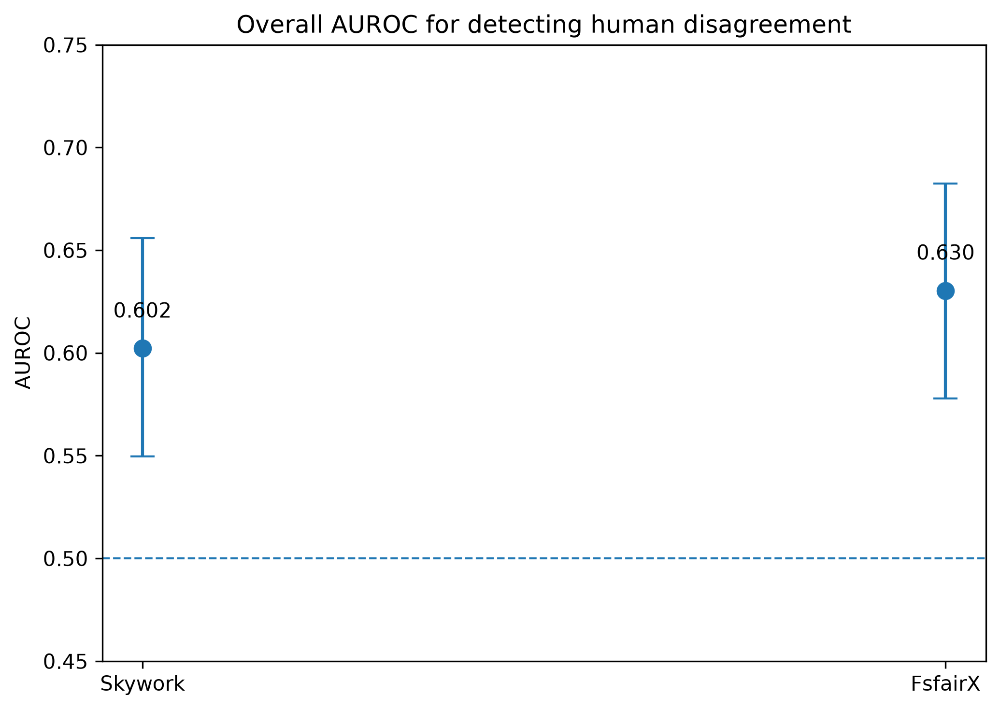
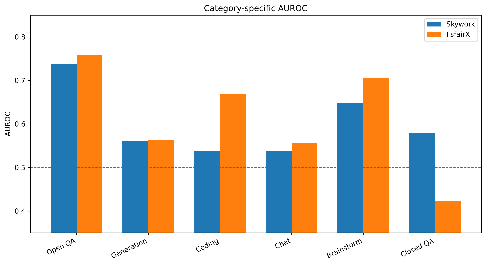
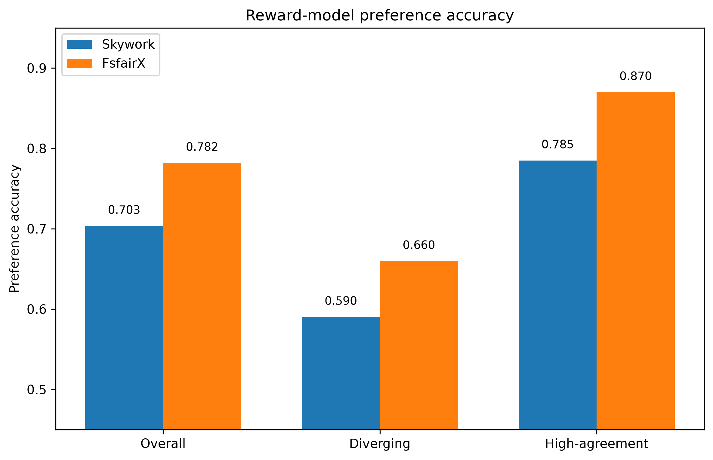
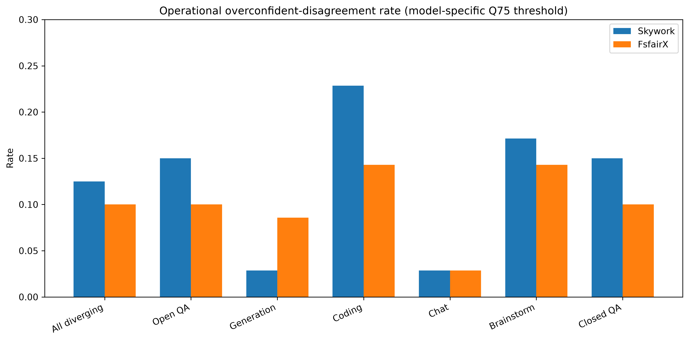

# Task-Conditioned Reward-Gap Diagnostics for Human Preference Disagreement

This repository studies whether the absolute score gap produced by a scalar reward model can identify preference pairs on which human annotators disagree, and whether that diagnostic signal changes across task scenarios.

The project began as a small reproduction of the reward-gap baseline from *Diverging Preferences: When do Annotators Disagree and do Models Know?* and was extended into a task-conditioned empirical analysis using two scalar reward models.

## Research Questions

1. Can a scalar reward model recover the human majority preference?
2. Can a small absolute reward gap identify examples with human preference disagreement?
3. Does disagreement-detection performance vary across task scenarios?
4. Does the relative performance of different reward models change across tasks?
5. How often do reward models assign a large score gap to examples on which humans disagree?

## Scope of the Contribution

The use of absolute reward gap as a disagreement signal is not introduced by this repository. The main empirical extension is to examine its reliability by task scenario and by reward-model checkpoint.

The current evidence should be interpreted as a pilot study rather than a definitive benchmark result.

## Data

- Dataset: MultiPref
- Formal sample size: 400 preference pairs
- Diverging examples: 200
- High-agreement examples: 200
- Task scenarios:
  - Open QA: 80
  - Generation: 70
  - Coding: 70
  - Chat: 70
  - Brainstorm: 70
  - Closed QA: 40

The repository does not redistribute raw prompts, raw responses, or model weights.

## Reward Models

- `Skywork/Skywork-Reward-Llama-3.1-8B-v0.2`
- `sfairXC/FsfairX-LLaMA3-RM-v0.1`

No reward model is trained in this project. The models are used only for inference.

## Core Definitions

For each preference pair:

```text
reward_gap = abs(score_a - score_b)
diverging_score = -reward_gap
```

A smaller reward gap is treated as stronger evidence that the model considers the two responses difficult to distinguish.

### Preference Accuracy

Preference accuracy is computed only for examples with a strict human majority:

```text
human_label = A, if n_A > n_B
human_label = B, if n_B > n_A
```

Examples with `n_A == n_B` are excluded from preference-accuracy calculations.

### Disagreement Detection

Diverging-ID AUROC evaluates whether `-abs(score_a - score_b)` separates diverging examples from high-agreement examples.

## Main Results

### Overall disagreement detection

| Reward model | AUROC | 95% bootstrap CI |
|---|---:|---:|
| Skywork 8B | 0.602 | [0.550, 0.656] |
| FsfairX 8B | 0.630 | [0.578, 0.683] |

The paired overall AUROC difference was 0.028 in favor of FsfairX, but its bootstrap confidence interval included zero.

### Task-specific AUROC

| Task scenario | Skywork 8B | FsfairX 8B |
|---|---:|---:|
| Open QA | 0.737 | 0.759 |
| Generation | 0.560 | 0.564 |
| Coding | 0.537 | 0.669 |
| Chat | 0.537 | 0.556 |
| Brainstorm | 0.648 | 0.705 |
| Closed QA | 0.580 | 0.423 |

The results suggest substantial task dependence. In particular, the relative ordering of the two models differs between Coding and Closed QA. Because category sample sizes are limited, these task-level results require validation on additional models and datasets.

### Preference accuracy

There were 344 examples with a strict human majority and 56 without a strict majority.

| Reward model | Overall preference accuracy |
|---|---:|
| Skywork 8B | 0.703 |
| FsfairX 8B | 0.782 |

Preference accuracy was lower on diverging examples than on high-agreement examples for both models.

### Operational high-gap disagreement rate

A model-specific threshold was defined as the 75th percentile of the absolute reward-gap distribution among high-agreement examples. Among diverging examples:

| Reward model | High-gap disagreement rate | Wilson 95% CI |
|---|---:|---:|
| Skywork 8B | 0.125 | [0.086, 0.178] |
| FsfairX 8B | 0.100 | [0.066, 0.149] |

This is an operational diagnostic, not a calibrated probability of model confidence.

## Figures









## Repository Structure

```text
.
├── README.md
├── requirements.txt
├── .gitignore
├── docs/
│   ├── README.md
│   ├── experiment_design.md
│   ├── results_summary.md
│   ├── reproducibility.md
│   └── data_release_policy.md
├── scripts/
│   ├── 01_...
│   ├── ...
│   └── 40_build_primary_results_summary_and_figures_v1.py
├── data_processed/
│   ├── frozen sample IDs
│   ├── frozen reward-model score tables
│   ├── public analysis table
│   └── manifests
├── results/
│   ├── AUROC tables
│   ├── bootstrap summaries
│   ├── preference-accuracy tables
│   └── operational high-gap disagreement tables
├── figures/
│   └── final figures
└── reports/
    └── research reports and advisor-facing summaries
```

## Reproduction

Install the project dependencies:

```bash
pip install -r requirements.txt
```

Run the formal-sample preparation, scoring, validation, and analysis scripts in numerical order. Scripts 32–40 operate on frozen score tables and do not require GPU inference.

Detailed instructions are provided in:

- [Experiment design](docs/experiment_design.md)
- [Results summary](docs/results_summary.md)
- [Reproducibility guide](docs/reproducibility.md)
- [Data and release policy](docs/data_release_policy.md)

## Public Release Policy

This repository may release:

- source code;
- aggregate result tables;
- figures;
- frozen sample IDs;
- reward-model score tables without prompt or response text;
- compact public analysis tables without raw text;
- integrity manifests.

This repository does not release:

- raw MultiPref data;
- full prompts;
- full response A or response B text;
- unsanitized annotation notes;
- model weights;
- access tokens;
- local model caches.

See [Data and release policy](docs/data_release_policy.md) for details.

## Limitations

1. The formal analysis uses one dataset and two reward models.
2. The total sample size is 400, with smaller sample sizes within task scenarios.
3. Category-level confidence intervals are wide for several tasks.
4. Manual disagreement-source labels overlap and are exploratory.
5. The analysis does not establish that reward gap is a calibrated uncertainty estimate.
6. The current results do not establish a new reward-model training method.
7. Task-level ranking reversals require replication before being treated as stable findings.

## Planned Extensions

- evaluate additional scalar reward models;
- validate on a second multi-annotator preference dataset;
- increase task-level sample sizes;
- test whether model-by-task interactions replicate;
- investigate which disagreement sources explain task-level differences;
- evaluate simple task-aware diagnostics on held-out data.

## Reference

- *Diverging Preferences: When do Annotators Disagree and do Models Know?*  
  https://arxiv.org/abs/2410.14632
